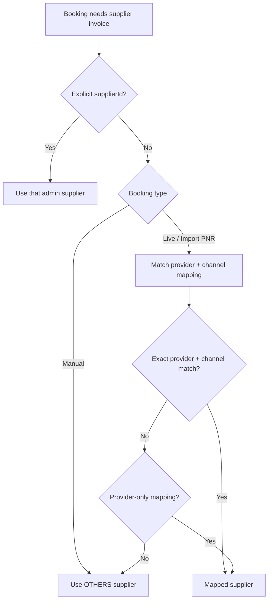

# Supplier Provider Map — Admin Implementation Guide

Admin-facing reference for configuring **which supplier receives payable invoices** based on booking **provider** and **channel**.

Live/online bookings no longer rely on auto-created “platform channel” supplier names. Instead, the backend resolves the supplier from **admin supplier `providerMappings`**, with **`OTHERS`** as the default fallback.

Platform channel options are loaded once at application startup from:

```http
GET {platform.info.url}/api/platform-info/me
x-api-key: {flight_api_key}
```

Configured in `application.properties`:

```properties
platform.info.url=https://data.shukrantrip.com
flight_api_key=...
```

Example platform response fragment:

```json
{
  "data": {
    "providersMap": [
      "SABRE: s-bd",
      "ARABIA: arabia-prod",
      "GROUP: group-uae",
      "USBANGLAAPI: usbangla-api",
      "VERTEIL: v-bd",
      "FLYDUBAI: FZ-U",
      "GALILEO: galileo-bd",
      "GALILEO: galileo-uae"
    ]
  }
}
```

---

## Overview

| Concept | Description |
|---------|-------------|
| **Provider** | GDS/API source enum (`SABRE`, `GALILEO`, `GROUP`, …) |
| **Channel** | Platform-specific channel code (e.g. `galileo-bd`, `s-bd`) from cached platform map |
| **Provider mapping** | Link on an admin supplier: `{ provider, channel? }` |
| **Default supplier** | Admin supplier with mapping `{ "provider": "OTHERS" }` (no channel) |
| **Branch** | Required for currency; supplier branch currency is used on invoices |

### How supplier is chosen at invoice time



**Live/online resolution order**

1. Exact match: `provider` + `channel`
2. Provider-wide match: `provider` with `channel = null` on mapping
3. Fallback: supplier mapped to **`OTHERS`**

**Manual booking**

- Does **not** use provider/channel from the request for supplier resolution.
- Uses `supplierId` when sent; otherwise uses the **`OTHERS`** supplier.
- `providerName` and `channel` on manual create are **optional** (stored as `OTHERS` / null when omitted).

---

## Authentication & permissions

| Action | Permission |
|--------|------------|
| List / view suppliers | `view-supplier` |
| Create supplier | `create-supplier` |
| Update supplier | `update-supplier` |
| Delete supplier | `delete-supplier` |
| Load platform provider options | `view-supplier` |

Base path: `/api/suppliers`

Admin portal only (`provider = admin`). Provider mappings apply to **admin-global suppliers** (`agency_id` is null).

---

## API endpoints

### 1. Get platform provider options (for UI dropdown)

Use this to populate the mapping picker in create/edit supplier forms.

```http
GET /api/suppliers/platform-providers
Authorization: Bearer <admin-token>
```

**Response**

```json
{
  "success": true,
  "data": [
    { "provider": "SABRE", "channel": "s-bd" },
    { "provider": "ARABIA", "channel": "arabia-prod" },
    { "provider": "GROUP", "channel": "group-uae" },
    { "provider": "USBANGLAAPI", "channel": "usbangla-api" },
    { "provider": "VERTEIL", "channel": "v-bd" },
    { "provider": "FLYDUBAI", "channel": "FZ-U" },
    { "provider": "GALILEO", "channel": "galileo-bd" },
    { "provider": "GALILEO", "channel": "galileo-uae" },
    { "provider": "OTHERS", "channel": null }
  ]
}
```

Notes:

- List is **cached at startup** — no external call on each request.
- `OTHERS` is appended by the backend for the default supplier option.
- Duplicate providers (e.g. two `GALILEO` channels) appear as separate rows.

---

### 2. List suppliers

```http
GET /api/suppliers?branchId=1
Authorization: Bearer <admin-token>
```

Optional `branchId` filter.

---

### 3. Get supplier by ID

```http
GET /api/suppliers/{id}
Authorization: Bearer <admin-token>
```

**Response includes `providerMappings`**

```json
{
  "success": true,
  "data": {
    "id": 12,
    "name": "Galileo BD Supplier",
    "title": "Galileo Bangladesh",
    "email": "galileo@example.com",
    "phoneNumber": "1234567890",
    "address": "Dhaka",
    "branchId": 1,
    "branch": {
      "id": 1,
      "name": "Main Branch",
      "currency": "BDT"
    },
    "initialBalance": "0.0000",
    "payableAMount": "15000.0000",
    "paidAMount": "5000.0000",
    "providerMappings": [
      { "provider": "GALILEO", "channel": "galileo-bd" }
    ]
  }
}
```

---

### 4. Create supplier

```http
POST /api/suppliers
Authorization: Bearer <admin-token>
Content-Type: application/json
```

**Request body**

| Field | Type | Required | Description |
|-------|------|----------|-------------|
| `name` | string | Yes | Supplier name |
| `email` | string | Yes | Unique email |
| `phoneNumber` | string | Yes | Max 15 chars |
| `address` | string | Yes | Address |
| `title` | string | No | Display title |
| `description` | string | No | Notes |
| `branchId` | long | No | Branch (recommended — needed for invoice currency) |
| `initialBalance` | decimal | No | Pre-system outstanding balance (default `0`) |
| `providerMappings` | array | No | Provider/channel assignments (see below) |

**Example — default (OTHERS) supplier**

```json
{
  "name": "Default Supplier",
  "title": "Manual & fallback supplier",
  "email": "default@example.com",
  "phoneNumber": "0000000000",
  "address": "N/A",
  "branchId": 1,
  "initialBalance": 0,
  "providerMappings": [
    { "provider": "OTHERS" }
  ]
}
```

**Example — live channel supplier**

```json
{
  "name": "Sabre BD",
  "title": "Sabre - s-bd",
  "email": "sabre@example.com",
  "phoneNumber": "1234567890",
  "address": "Dhaka",
  "branchId": 1,
  "providerMappings": [
    { "provider": "SABRE", "channel": "s-bd" }
  ]
}
```

**Example — one supplier, multiple channels**

```json
{
  "name": "Galileo Supplier",
  "email": "galileo@example.com",
  "phoneNumber": "1234567890",
  "address": "Dubai",
  "branchId": 2,
  "providerMappings": [
    { "provider": "GALILEO", "channel": "galileo-bd" },
    { "provider": "GALILEO", "channel": "galileo-uae" }
  ]
}
```

---

### 5. Update supplier

```http
PUT /api/suppliers/{id}
Authorization: Bearer <admin-token>
Content-Type: application/json
```

Same body shape as create. When `providerMappings` is sent, it **replaces** all existing mappings for that supplier.

To clear mappings, send `"providerMappings": []`.

---

### 6. Delete supplier

```http
DELETE /api/suppliers/{id}
Authorization: Bearer <admin-token>
```

Soft-deletes supplier and removes its provider mappings.

---

## Provider mapping rules

| Rule | Detail |
|------|--------|
| Unique pair | Each `{ provider, channel }` can belong to **one supplier only** |
| Channel required for live providers | Must match an entry from `/platform-providers` (except `OTHERS`) |
| `OTHERS` | No channel; marks the **default fallback** supplier |
| Provider-only mapping | `{ "provider": "SABRE" }` without channel — matches any Sabre channel if no exact match |
| Admin suppliers only | Mappings are stored only on admin-global suppliers |

### Valid `provider` enum values

`TBO`, `SABRE`, `ARABIA`, `AKIJ`, `USBANGLA`, `VERTEIL`, `GROUP`, `USBANGLAAPI`, `FLYDUBAI`, `GALILEO`, `OTHERS`

---

## Booking flows & supplier resolution

### Online / live booking

- Channel comes from cached platform map (`PlatformProviderService`) using booking provider.
- Invoice supplier = supplier with matching `providerMappings`.
- If nothing matches → **`OTHERS`** supplier.

### Import PNR

- Uses booking `providerName` + `channel` like live bookings.
- Optional `supplierId` overrides mapping lookup.

### Manual booking

```http
POST /api/bookings/manual
```

| Field | Required | Notes |
|-------|----------|-------|
| `supplierId` | No | If set, that supplier is used for invoice |
| `providerName` | No | Not used for supplier resolution |
| `channel` | No | Not used for supplier resolution |

When `supplierId` is omitted, the **`OTHERS`** supplier is used.

Manual booking still requires: agency, trip type, booking class, airline, price, travellers, etc.

---

## Admin UI implementation checklist

### Supplier create / edit form

1. Load options: `GET /api/suppliers/platform-providers`
2. Show multi-select or tag input for mappings (provider + channel pairs)
3. Always allow selecting **`OTHERS`** (no channel) on exactly one supplier
4. Require **branch** with currency for suppliers that receive invoices
5. On save, send full `providerMappings` array on create/update

### Suggested UX

| UI element | Behaviour |
|------------|-----------|
| Provider mapping picker | Options from `/platform-providers` |
| Default supplier badge | Show when supplier has `{ provider: "OTHERS" }` |
| Validation hint | “Each provider+channel can only be assigned once” |
| Branch field | Required warning if currency missing |

### Recommended initial setup

1. Create **one supplier** with `{ "provider": "OTHERS" }` and a branch (currency set)
2. Create suppliers per live channel, e.g.:
   - Sabre → `SABRE` / `s-bd`
   - Galileo BD → `GALILEO` / `galileo-bd`
   - Galileo UAE → `GALILEO` / `galileo-uae`
3. Run a test online booking and confirm the correct supplier payable is updated

---

## Validation errors (common)

| Error | Cause |
|-------|-------|
| `Invalid provider mapping: GALILEO: wrong-channel` | Channel not in platform cache |
| `Provider mapping already assigned to another supplier` | Duplicate `{ provider, channel }` |
| `Default admin supplier is not configured. Assign Provider.OTHERS to a supplier.` | No supplier has `OTHERS` mapping |
| `Supplier currency is empty. Please set the currency for supplier branch.` | Supplier branch has no currency |

---

## Database

Migration: `V41__supplier_provider_map.sql`

Table: `supplier_provider_mappings`

| Column | Description |
|--------|-------------|
| `supplier_id` | FK → `suppliers.id` |
| `provider` | Provider enum string |
| `channel` | Channel code (nullable for provider-wide / `OTHERS`) |

Unique constraint: `(provider, channel)`

---

## Related backend services

| Service | Role |
|---------|------|
| `PlatformProviderService` | Loads & caches platform `providersMap` at startup |
| `SupplierResolverService` | Resolves supplier from mappings + `OTHERS` fallback |
| `SupplierService` | CRUD + mapping validation |
| `BookingCoordinatorService` | Creates supplier invoice after booking |

---

## Example: end-to-end mapping setup

**Platform channels (cached):**

```
SABRE → s-bd
GALILEO → galileo-bd, galileo-uae
```

**Admin configuration:**

| Supplier | Mappings |
|----------|----------|
| Default Co | `OTHERS` |
| Sabre Ltd | `SABRE` / `s-bd` |
| Galileo Co | `GALILEO` / `galileo-bd`, `GALILEO` / `galileo-uae` |

**Result:**

| Booking | Invoice supplier |
|---------|-------------------|
| Online Sabre `s-bd` | Sabre Ltd |
| Online Galileo `galileo-uae` | Galileo Co |
| Manual booking (no supplierId) | Default Co |
| Online unknown/unmapped channel | Default Co |
