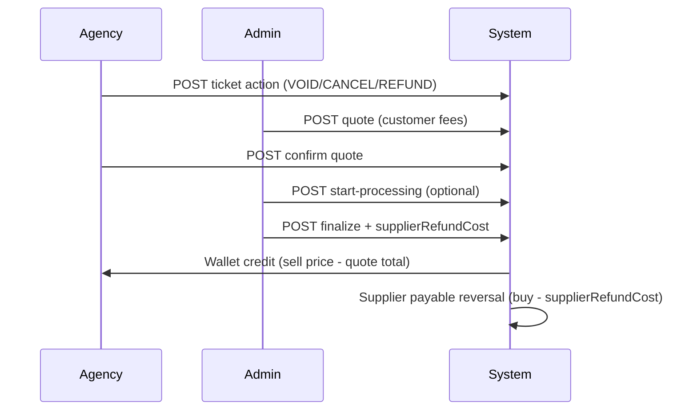
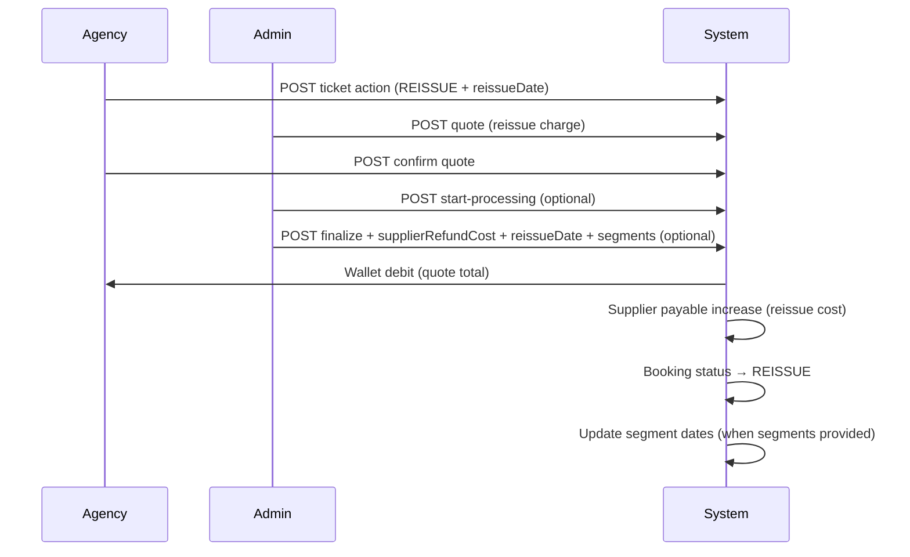

# Ticket Action Admin API

Admin-facing reference for void / cancel / refund / **reissue** ticket action requests, including **supplier refund cost** on finalize (after the user accepts the quote).

Base paths:

- Admin: `/api/admin/ticket-actions`
- Agency (booking-scoped): `/api/bookings/{bookingId}/ticket-actions`

Related: [Booking Refund Admin API](./booking-refund-admin-api.md) (direct admin refund without ticket action flow), [Activity Feed Admin API](./activity-feed-admin-api.md) (live ops feed including ticket actions).

---

## Flow overview

### Void / cancel / refund



### Reissue



| Step | Status | Who |
|------|--------|-----|
| 1. Submit | `SUBMITTED` | Agency user |
| 2. Quote | `QUOTED` | Admin |
| 3. Confirm | `USER_CONFIRMED` | Agency user |
| 4. Processing (optional) | `ADMIN_PROCESSING` | Admin |
| 5. Finalize | `COMPLETED` or `FAILED` | Admin |

---

## Two independent amounts (framed by profitLoss)

**`profitLoss`** = `bookingPrice − buyPrice` (original margin) is the **key metric** for admin decisions.

| Side | When set | Field | Meaning |
|------|----------|-------|---------|
| **Margin (key)** | From booking | `profitLoss` / `netProfitLoss` | Original margin and outcome after finalize |
| **Customer** | Admin **quote** (before user confirms) | `totalAmount` (+ airline/service breakdown) | Fee charged to customer |
| **Supplier** | Admin **finalize** (after user confirms) | `supplierRefundCost` | Supplier cost kept / reissue cost |

### Void / cancel / refund

```
profitLoss = bookingPrice - buyPrice
netProfitLoss = profitLoss - supplierRefundCost + quoteTotalAmount
```

On **COMPLETED** finalize the agency wallet is **credited**: `bookingPrice − quoteTotalAmount`.

Supplier payable is **reversed**: `buyPrice − supplierRefundCost`.

### Reissue

```
netProfitLoss = profitLoss + (quoteTotalAmount - supplierRefundCost)
```

On **COMPLETED** reissue finalize the agency wallet is **debited** by **`quoteTotalAmount` only** (the quoted reissue charge — not the full booking price).

The debit is recorded as **`ADMIN_CHARGE`** (wallet deposit + transaction), not a second **`PURCHASE`**.

**Balance bypass:** Admin reissue finalize skips the insufficient-balance check (same as admin booking edit). The agency wallet may go **negative** if funds are insufficient.

Supplier payable is **increased** by `supplierRefundCost` (supplier reissue cost).

These amounts are **not linked**. Example (refund):

| Item | USD |
|------|-----|
| Buy price | 900 |
| Sell price | 1,200 |
| **profitLoss** | **300** |
| Quote total (customer fee) | 400 → wallet credit **800** |
| `supplierRefundCost` on finalize | 200 → payable reversed **700**, remaining **200** |
| **netProfitLoss** | 300 − 200 + 400 = **500** |

Example (reissue):

| Item | USD |
|------|-----|
| Buy price | 900 |
| Sell price | 1,200 |
| **profitLoss** | **300** |
| Quote total (reissue charge) | 150 → wallet **debit 150** |
| `supplierRefundCost` on finalize | 100 → supplier payable **+100** |
| **netProfitLoss** | 300 + (150 − 100) = **350** |

---

## Permissions

| Action | Permission |
|--------|------------|
| List / view requests | `admin-view-ticket-action-requests` |
| Quote / reject | `admin-quote-ticket-action-request` |
| Start processing / finalize | `admin-finalize-ticket-action-request` |
| Agency create / confirm | `view-booking` + booking access |

---

## Admin endpoints

### GET `/api/admin/ticket-actions`

List all ticket action requests.

| Query | Description |
|-------|-------------|
| `status` | e.g. `USER_CONFIRMED`, `QUOTED`, `COMPLETED` |
| `type` | `VOID`, `CANCEL`, `REFUND`, `REISSUE` |
| `page`, `size` | Pagination |

### GET `/api/admin/ticket-actions/confirmed`

Shortcut for `status=USER_CONFIRMED` — queue ready for processing/finalize.

### POST `/api/admin/ticket-actions/{requestId}/quote`

Send quote to customer (customer-side fees only).

```json
{
  "airlineCost": 300.00,
  "serviceCharge": 100.00,
  "totalAmount": 400.00,
  "currency": "USD",
  "details": "Airline penalty + service fee",
  "adminNote": "Non-refundable fare",
  "acceptDeadline": "2026-07-10T23:59:59",
  "refundTimeline": "3-5 business days"
}
```

| Field | Required | Description |
|-------|----------|-------------|
| `airlineCost` | Yes | Airline portion of customer fee |
| `serviceCharge` | Yes | Agency service charge |
| `totalAmount` | Yes | Total customer fee (deducted from sell price on completion) |
| `acceptDeadline` | No | Auto-reject if user does not confirm in time |
| `refundTimeline` | No | Display-only timeline for customer |

### POST `/api/admin/ticket-actions/{requestId}/reject`

Reject request (any non-terminal status).

### POST `/api/admin/ticket-actions/{requestId}/start-processing`

Move `USER_CONFIRMED` → `ADMIN_PROCESSING` (optional).

### POST `/api/admin/ticket-actions/{requestId}/finalize`

Complete or fail the request. **Supplier cost is captured here.**

#### Void / cancel / refund

```json
{
  "resultStatus": "COMPLETED",
  "finalResult": "Void processed with airline",
  "externalReference": "AIR-REF-12345",
  "supplierRefundCost": 200.00
}
```

| Field | Required | Description |
|-------|----------|-------------|
| `resultStatus` | Yes | `COMPLETED` or `FAILED` |
| `finalResult` | No | Notes shown to customer |
| `externalReference` | No | Airline/GDS reference |
| `supplierRefundCost` | **Yes when COMPLETED** | Supplier cost kept (USD). Use `0` for full supplier credit |

#### Reissue

```json
{
  "resultStatus": "COMPLETED",
  "finalResult": "Reissued with airline — new travel date",
  "externalReference": "AIR-REISSUE-98765",
  "supplierRefundCost": 100.00,
  "reissueDate": "2026-08-15",
  "segments": [
    {
      "segmentOrder": 0,
      "depTime": "2026-08-15T08:30",
      "arrTime": "2026-08-15T14:45"
    },
    {
      "segmentOrder": 1,
      "depTime": "2026-08-22T16:00",
      "arrTime": "2026-08-22T22:10"
    }
  ]
}
```

| Field | Required | Description |
|-------|----------|-------------|
| `resultStatus` | Yes | `COMPLETED` or `FAILED` |
| `finalResult` | No | Notes shown to customer |
| `externalReference` | No | Airline/GDS reference |
| `supplierRefundCost` | **Yes when COMPLETED** | Supplier reissue cost (USD). Must not exceed `quoteTotalAmount` |
| `reissueDate` | **Yes when COMPLETED** | Calendar date ticket was reissued with airline. Falls back to agency-submitted value if omitted |
| `segments` | No | Update booking segment departure/arrival times (see below) |

##### Segment date updates (`segments`)

When admin finalizes a **REISSUE** with `resultStatus = COMPLETED`, optional `segments` updates the booking itinerary to match the reissued ticket.

| Field | Required | Description |
|-------|----------|-------------|
| `segmentOrder` | Yes | Matches existing `booking_segment.segment_order` (0-based) |
| `depTime` | No* | Origin departure — ISO datetime, e.g. `2026-08-15T08:30` |
| `arrTime` | No* | Destination arrival — ISO datetime, e.g. `2026-08-15T14:45` |

\* At least one of `depTime` or `arrTime` per segment entry.

**What gets updated:**

1. `segment_airport.time` for ORIGIN (`depTime`) and/or DESTINATION (`arrTime`)
2. `travel_information.departure_date`, `departure_time` — from first segment origin
3. `travel_information.arrival_date`, `arrival_time` — from last segment destination

All segment and travel updates run in the **same transaction** as wallet debit, supplier charge, and booking status change. If any step fails, everything rolls back.

**Admin UI tip:** Load current segments from `GET /api/bookings/{bookingId}` (`travelInformation.segments`), pre-fill times, let admin edit dates, then POST on finalize.

#### When `resultStatus = COMPLETED` (void / cancel / refund)

1. **Wallet** — credits agency: `bookingPrice − quoteTotalAmount` (customer fee from quote).
2. **Booking** — status updated via ticket action type (`VOID`, `TICKET_CANCELLED`, etc.).
3. **Supplier payable** — same rules as [booking refund](./booking-refund-admin-api.md):
   - `supplierPayableReversed = buyPrice − supplierRefundCost`
   - `remainingSupplierPayable = supplierRefundCost`
4. **Audit** — values stored on the ticket action request record.

#### When `resultStatus = COMPLETED` (reissue)

1. **Wallet** — debits agency by **`quoteTotalAmount` only** as **`ADMIN_CHARGE`**. Balance check is bypassed; wallet may go negative.
2. **Booking** — status set to `REISSUE`.
3. **Supplier payable** — increased by `supplierRefundCost` (append-only supplier ledger entry).
4. **Segments** — optional `segments` payload updates itinerary dates (see above).
5. **Audit** — reissue metadata including `reissueDate`, charge amounts, and segment updates when provided.

#### When `resultStatus = FAILED`

No wallet movement, no supplier adjustment, no segment updates. `supplierRefundCost` and `segments` are ignored.

#### Validation

| Rule | Error |
|------|-------|
| `supplierRefundCost` missing on COMPLETED | Required error |
| `supplierRefundCost` > `buyPrice` (refund types) | Cannot exceed buy price |
| `reissueDate` missing on REISSUE COMPLETED | Required error |
| `supplierRefundCost` > `quoteTotalAmount` (reissue) | Cannot exceed reissue charge |
| Invalid `segmentOrder` | No matching segment on booking |
| Segment entry with neither `depTime` nor `arrTime` | Validation error |
| Finalize from wrong status | Must be `USER_CONFIRMED` or `ADMIN_PROCESSING` |

---

## Response fields (admin UI)

After finalize, `TicketActionRequestResponse` includes:

| Field | Description |
|-------|-------------|
| `buyPrice` | Booking supplier buy price (USD) |
| `profitLoss` | **Original margin** (`bookingPrice − buyPrice`) — key reference |
| `netProfitLoss` | Outcome after finalize (formula differs for refund vs reissue) |
| `totalAmount` | Customer quote total (fee or reissue charge) |
| `supplierRefundCost` | Supplier cost kept / reissue cost (set on COMPLETED) |
| `supplierPayableReversed` | Removed from supplier payable (refund) or reissue cost recorded |
| `remainingSupplierPayable` | Still owed to supplier for this PNR (refund types) |
| `refunded` | `true` when wallet/supplier processing ran (refund credit); `false` for reissue |
| `reissueDate` | Reissue calendar date (REISSUE type, COMPLETED only) |
| `reissueChargeAmount` | Amount debited from agency wallet (REISSUE type, COMPLETED only) |

---

## Agency endpoints (reference)

| Method | Path | Description |
|--------|------|-------------|
| POST | `/api/bookings/{bookingId}/ticket-actions` | Submit request (`reissueDate` required when `type = REISSUE`) |
| GET | `/api/bookings/{bookingId}/ticket-actions` | List for booking |
| GET | `/api/bookings/{bookingId}/ticket-actions/{requestId}` | Detail |
| POST | `/api/bookings/{bookingId}/ticket-actions/{requestId}/confirm` | Accept quote |

Agency submit example (reissue):

```json
{
  "type": "REISSUE",
  "reason": "Change travel date",
  "reissueDate": "2026-08-15"
}
```

---

## Admin UI — finalize screen

### Refund / void / cancel

Show after user confirmed (`USER_CONFIRMED` or `ADMIN_PROCESSING`):

```
Booking
  PNR: ABC123
  Sell price: 1,200 USD
  Buy price:  900 USD
  profitLoss: 300 USD   ← original margin (key)

Customer quote (already accepted)
  Airline cost:    300
  Service charge:  100
  Total fee:       400  → wallet credit: 800

Supplier adjustment
  Supplier cost kept: [200.00]  (required)
  → Payable reversed: 700
  → Remaining payable (PNR): 200
  → netProfitLoss: 500   ← profitLoss - supplierRefundCost + quoteTotal

Result
  ( ) COMPLETED   ( ) FAILED
  Final result: [________________]
  External ref: [________________]

[ Finalize ]
```

### Reissue

```
Booking
  PNR: ABC123
  Sell price: 1,200 USD
  Buy price:  900 USD
  profitLoss: 300 USD

Customer quote (already accepted)
  Reissue charge: 150  → wallet DEBIT: 150

Supplier adjustment
  Supplier reissue cost: [100.00]  (required)
  → netProfitLoss: 350   ← profitLoss + (150 - 100)

Reissue
  Reissue date: [2026-08-15]  (required)

Segment dates (optional — update booking itinerary)
  Seg 0: DEP [2026-08-15T08:30]  ARR [2026-08-15T14:45]
  Seg 1: DEP [2026-08-22T16:00]  ARR [2026-08-22T22:10]

Result
  ( ) COMPLETED   ( ) FAILED
  Final result: [________________]
  External ref: [________________]

[ Finalize ]
```

---

## Migration

- `V48__ticket_action_supplier_refund_cost.sql` — adds `supplier_refund_cost`, `supplier_payable_reversed`, `remaining_supplier_payable` to `ticket_action_request`.
- `V58__ticket_action_reissue.sql` — adds `REISSUE` ticket action type and booking status.
- `V59__ticket_action_reissue_date.sql` — adds `reissue_date` on `ticket_action_request`.
